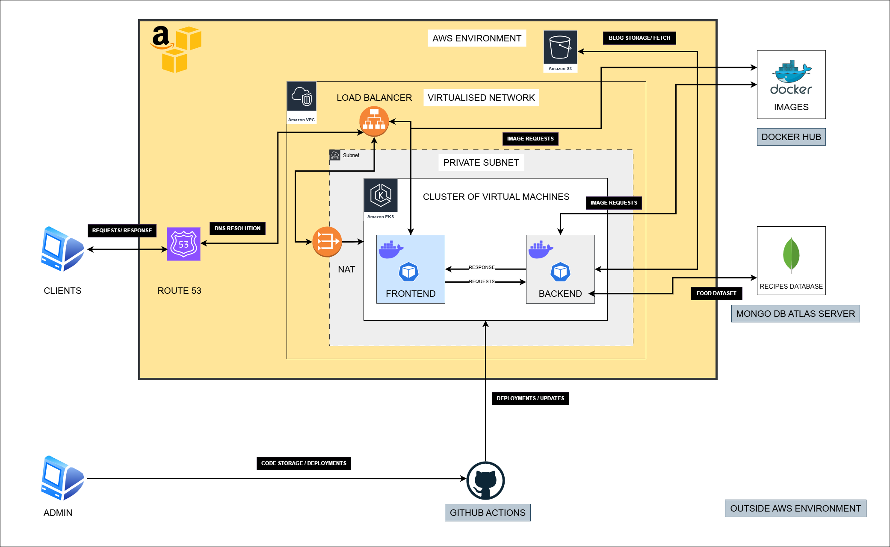

# CookSmart 

This repository contains the frontend application code and its docker files for the "CookSmart" application that i developed.

## Description

CookSmart is an application that allows users to input body metrics, diet preferences and other information 
to receive an analysis dashboard as well as a custom diet plan. The app is completely serverless and runs
using various services such as EKS, S3, Route 53, VPC etc. An overall architecture diagram of the project
is given below. (Note: The S3 bucket storing blog data is not part of the terraform configuration currently 
due to some data being added externally through an admin panel and not automatically)




## Getting Started

### Dependencies/Requirements

* Please follow the instructions on the terraform repository incase the infrastructure is needed.
* Docker installed locally, if images are to be modified.
* Docker Desktop for local testing and deployment.
* Kubernetes enabled in Docker Desktop
* WSL enabled in case of Windows OS.


### Installing

Since it is a containerised application run on docker and managed by kubernetes


## Help


```


```


## Authors

Contributors names and contact info


## Version History


## License


## Acknowledgments

Inspiration, code snippets, etc.
* [awesome-readme](https://github.com/matiassingers/awesome-readme)